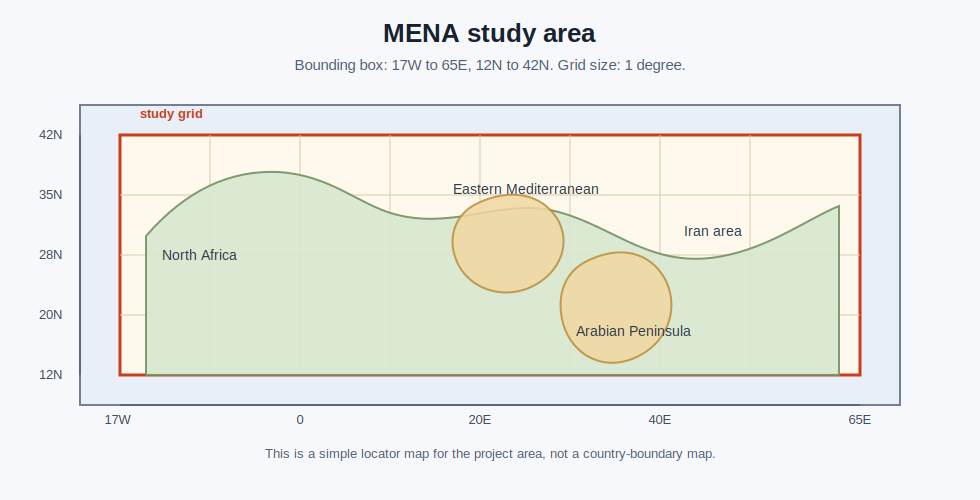
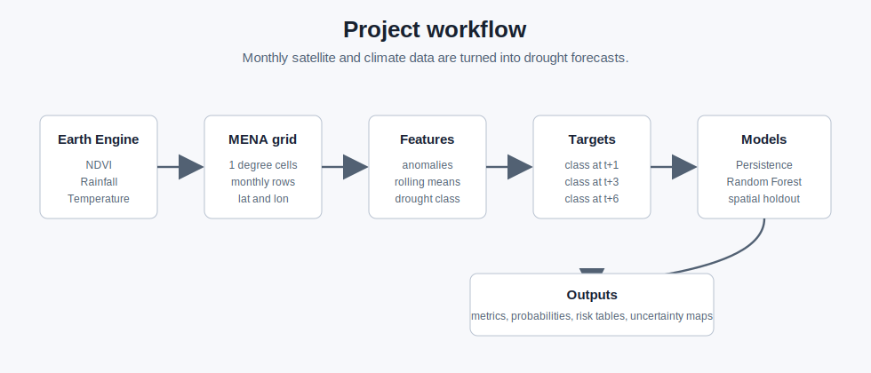
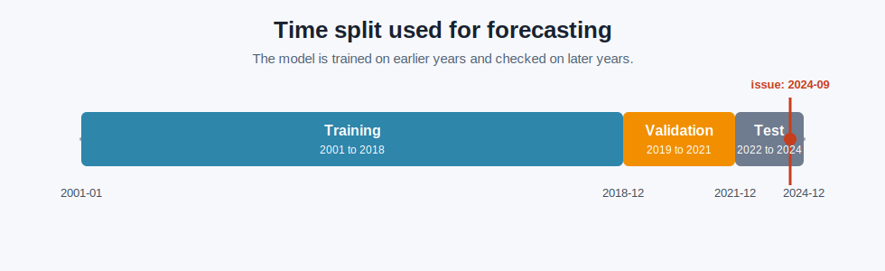
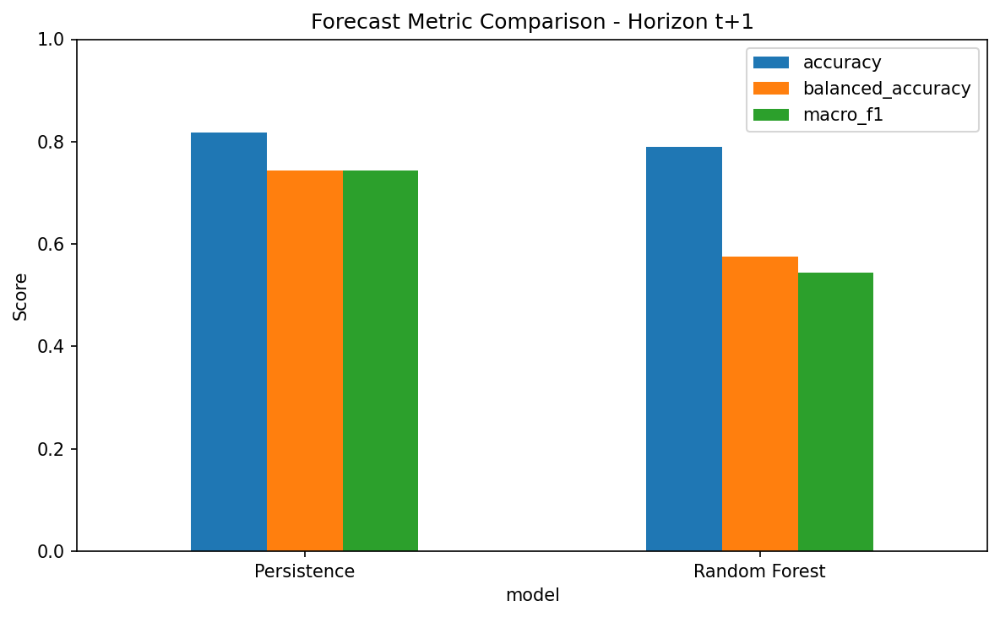
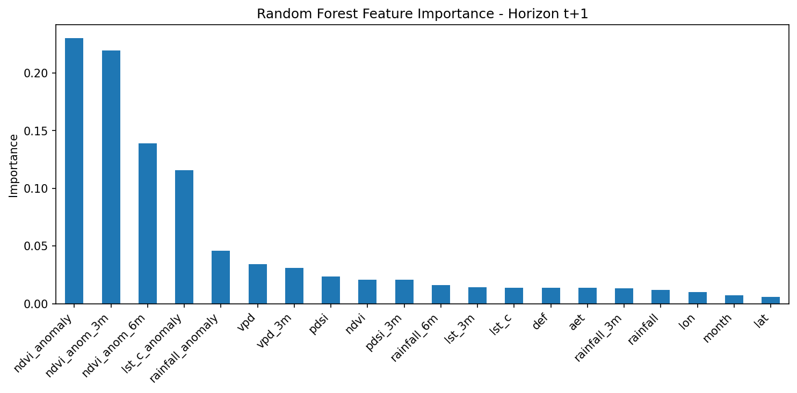
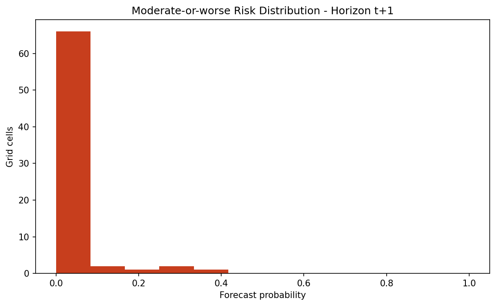

# MENA-DroughtBench - Short Project Report

## Project Result

MENA-DroughtBench is a drought early-warning benchmark for the MENA region. It forecasts drought class at 1, 3, and 6 months ahead, checks the models with temporal and spatial validation, exports class probabilities, and creates forecast and risk maps.

The completed local run uses a reproducible sample grid with the same columns expected from the Earth Engine export. It has 72 grid cells and 20,736 monthly rows from January 2001 to December 2024.

The local run checks the full path from input table to final outputs. The reported scores are sample-run scores, not final operational accuracy for real satellite data. Real performance depends on running the Earth Engine extraction with the same pipeline.

## Benchmark Additions

| Addition | Purpose | Output |
|---|---|---|
| 6-month forecast horizon | Adds a longer warning lead time | `t+6` metrics and figures |
| Spatial holdout validation | Checks transfer to unseen regions | `outputs/tables/spatial_validation_metrics.csv` |
| Class probabilities | Reports risk, not only one class | probability columns in the issue table |
| Uncertainty score | Marks lower-confidence cells | `rf_uncertainty` |
| Moderate-or-worse risk | Supports decision-ready drought warning | `rf_moderate_plus_risk` |
| Risk map | Maps risk intensity | `outputs/maps/forecast_risk_map_h1_2024_09.html` |

## Workflow

| Step | Work completed | Result |
|---|---|---|
| 1 | Built the monthly grid table | `data/processed/monthly_grid.csv` |
| 2 | Added drought features | anomalies, rolling means, drought classes |
| 3 | Created future targets | drought class at `t+1`, `t+3`, and `t+6` |
| 4 | Split by time | train to 2018-12, validation to 2021-12, test after 2021-12 |
| 5 | Trained baselines | Persistence and Random Forest |
| 6 | Added spatial validation | west, central, and east holdout regions |
| 7 | Exported probabilities | risk, confidence, and uncertainty columns |
| 8 | Created maps and figures | forecast map, risk map, confusion matrices, feature importance |
| 9 | Checked the code | 11 unit tests passed |

## Data Used

| Data group | Real-data source planned in the workflow | Local run columns |
|---|---|---|
| Vegetation | MODIS NDVI | `ndvi` |
| Rainfall | CHIRPS daily rainfall | `rainfall` |
| Temperature | MODIS land surface temperature | `lst_c` |
| Water balance | TerraClimate | `pdsi`, `vpd`, `aet`, `def` |
| Location | MENA grid cell center | `lat`, `lon`, `cell_id` |

The local sample table supports a complete project run without waiting for Earth Engine export.

## Time Split

| Period | Dates | Use |
|---|---|---|
| Training | 2001-01 to 2018-12 | Fit the model and calculate climatology |
| Validation | 2019-01 to 2021-12 | Check model setup before final testing |
| Test | 2022-01 to 2024-12 | Final model check on later months |
| Forecast issue | 2024-09 | Exported map and issue table |

## Model Results

| Horizon | Model | Accuracy | Balanced accuracy | Macro F1 |
|---|---|---:|---:|---:|
| t+1 | Persistence | 0.819 | 0.744 | 0.744 |
| t+1 | Random Forest | 0.790 | 0.576 | 0.545 |
| t+3 | Persistence | 0.730 | 0.593 | 0.594 |
| t+3 | Random Forest | 0.727 | 0.500 | 0.479 |
| t+6 | Persistence | 0.606 | 0.401 | 0.398 |
| t+6 | Random Forest | 0.670 | 0.378 | 0.372 |

Persistence was the strongest baseline by macro F1 in this sample run. Random Forest produced probability outputs and risk maps, which support decision products even when the hard class score does not beat persistence.

## Spatial Validation

The spatial check holds out one longitude band at a time. The model trains on earlier months outside the held-out band and tests on later months inside the held-out band.

| Horizon | Random Forest accuracy | Random Forest balanced accuracy | Random Forest macro F1 |
|---|---:|---:|---:|
| t+1 | 0.762 | 0.583 | 0.561 |
| t+3 | 0.715 | 0.533 | 0.509 |
| t+6 | 0.675 | 0.445 | 0.433 |

This adds a spatial transfer test beyond temporal evaluation alone.

## Forecast Risk Map

The exported forecast issue is September 2024 for the 1-month horizon.

[Forecast class map](outputs/maps/forecast_map_h1_2024_09.html)

[Forecast risk map](outputs/maps/forecast_risk_map_h1_2024_09.html)

| Random Forest forecast class | Cells |
|---|---:|
| Normal / Wet | 54 |
| Mild Drought | 18 |

| Moderate-or-worse risk band | Cells |
|---|---:|
| 0-25% | 69 |
| 25-50% | 3 |
| 50-75% | 0 |
| 75-100% | 0 |

## Novelty

This project is not presented as the first drought forecast project for MENA. Similar work already exists in remote-sensing drought monitoring, vegetation-health forecasting, and machine learning for drought assessment.

The main contribution is the benchmark structure:

| Existing work | What this project adds |
|---|---|
| Remote-sensing drought monitoring | A forecast target for each grid cell and month |
| Vegetation-health forecasting | Drought class forecasts at fixed warning horizons |
| Machine learning drought studies | Persistence baseline, Random Forest baseline, and fixed split tables |
| Standard temporal testing | Added spatial holdout validation |
| Single forecast class maps | Probability, uncertainty, and moderate-or-worse risk maps |

Contribution statement:

> MENA-DroughtBench is a reproducible satellite-climate drought early-warning benchmark with fixed temporal and spatial validation, baseline models, class probabilities, uncertainty fields, and map-ready drought-risk outputs for 1-, 3-, and 6-month horizons.

Reference context:

- [MODIS monthly NDVI in Earth Engine](https://developers.google.com/earth-engine/datasets/catalog/MODIS_061_MOD13A3)
- [CHIRPS daily rainfall in Earth Engine](https://developers.google.com/earth-engine/datasets/catalog/UCSB-CHG_CHIRPS_DAILY)
- [TerraClimate water-balance data in Earth Engine](https://developers.google.com/earth-engine/datasets/catalog/IDAHO_EPSCOR_TERRACLIMATE)
- [Forecasting vegetation health in the MENA region](https://digitalcommons.chapman.edu/scs_articles/689/)
- [Analysis and predictability of drought in Northwest Africa](https://www.nature.com/articles/s41598-018-37911-x)
- [Multisource remote sensing and machine learning for drought assessment in Northeast Syria](https://www.mdpi.com/2071-1050/17/24/10933)

## Finished Files

| Output | File |
|---|---|
| Sample data builder | `scripts/build_sample_monthly_grid.py` |
| Processed monthly grid | `data/processed/monthly_grid.csv` |
| Model metrics | `outputs/tables/forecast_model_metrics.csv` |
| Spatial validation metrics | `outputs/tables/spatial_validation_metrics.csv` |
| Forecast issue table | `outputs/tables/forecast_issue_table_h1_2024_09.csv` |
| Forecast class map | `outputs/maps/forecast_map_h1_2024_09.html` |
| Forecast risk map | `outputs/maps/forecast_risk_map_h1_2024_09.html` |
| Run summary | `outputs/reports/baseline_run_summary.md` |
| Confusion matrices | `outputs/figures/*confusion_matrix*.png` |
| Metric charts | `outputs/figures/forecast_metric_comparison_h1.png`, `outputs/figures/forecast_metric_comparison_h3.png`, `outputs/figures/forecast_metric_comparison_h6.png` |
| Feature importance charts | `outputs/figures/rf_feature_importance_h1.png`, `outputs/figures/rf_feature_importance_h3.png`, `outputs/figures/rf_feature_importance_h6.png` |

## Project Status

The project now has a complete local run, three forecast horizons, spatial validation, probability outputs, uncertainty fields, risk maps, figures, tables, and a revised report.
